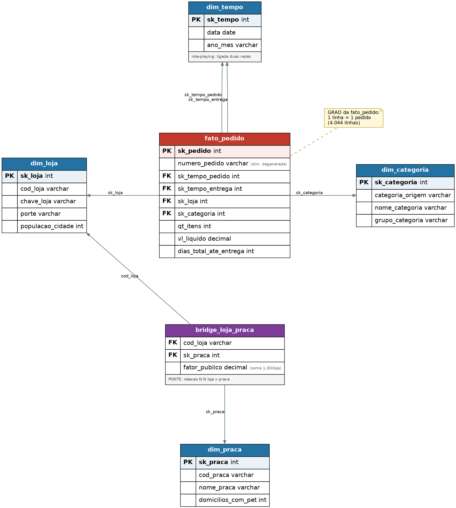
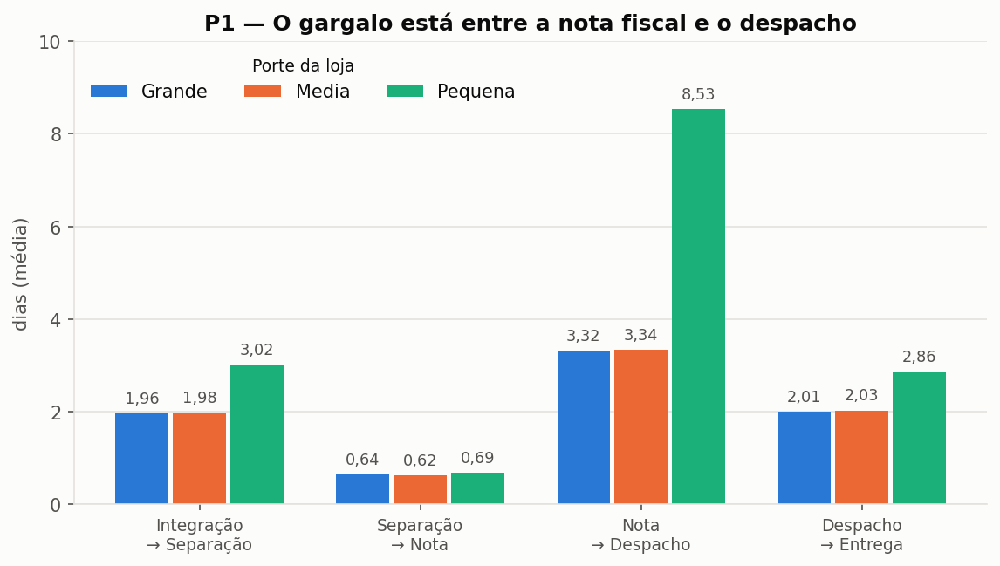
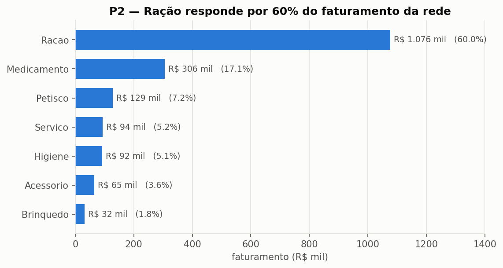
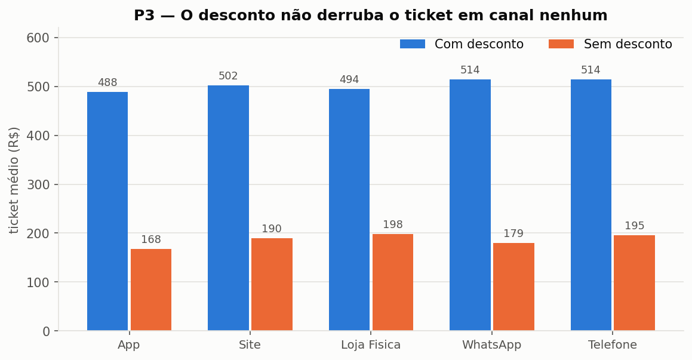
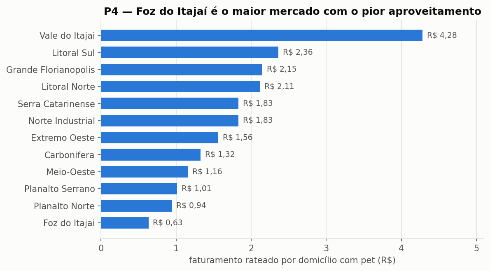
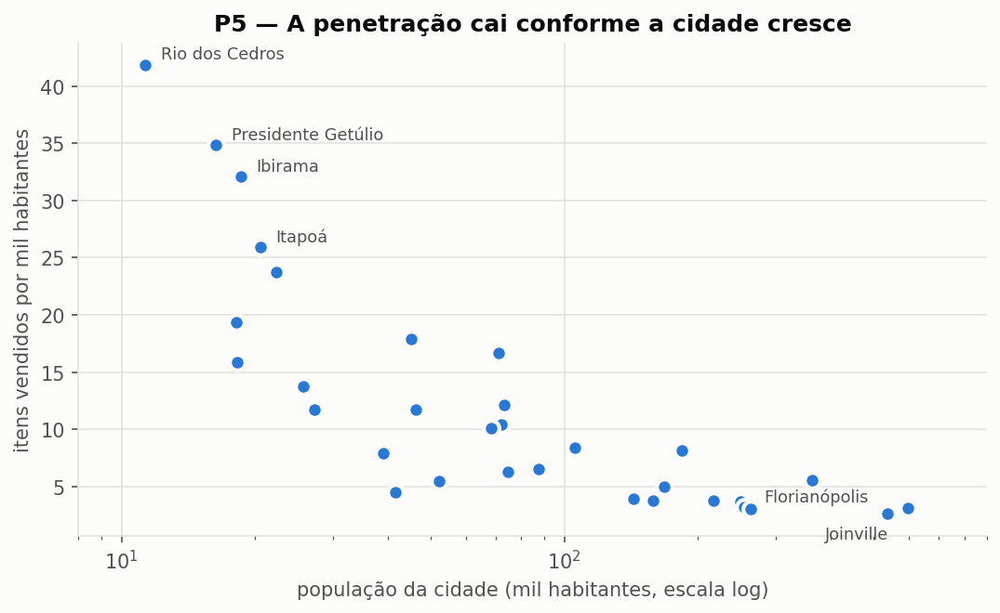

# Pata Amiga — Modelagem Dimensional em SQL

Mini-Projeto Avaliativo do Módulo 2 — Análise de Dados com Python [T1]

---

## 1. O case

A **Pata Amiga** é uma rede catarinense de pet shops com 32 lojas. Em setembro
de 2023 ligou a operação de pedidos com entrega e, em sete meses, registrou
**4.044 pedidos**.

O dado está em três sistemas que não conversam: a plataforma de e-commerce, o
cadastro de lojas do franchising e a planilha de praças de atendimento. Cada um
escreve do seu jeito — a mesma loja aparece com acento, sem acento, em caixa
alta e com erro de digitação; a mesma categoria tem várias grafias; data e
dinheiro chegam como texto.

Este projeto constrói o modelo dimensional que torna respondíveis cinco
perguntas de negócio:

| # | Pergunta |
|---|---|
| **P1** | Onde está o gargalo da entrega, e ele é o mesmo nos três portes de loja? |
| **P2** | Qual categoria concentra o faturamento? |
| **P3** | O desconto funciona igual em todo canal? |
| **P4** | Qual praça concentra o faturamento, aplicado o rateio? |
| **P5** | Onde abrir a próxima loja — e o que os dados **não** permitem afirmar? |

---

## 2. Como reproduzir

**Pré-requisito:** PostgreSQL 16+ (testado na 17.9), com `psql` no `PATH`.

Na pasta do repositório:

```powershell
$env:PGCLIENTENCODING = "UTF8"

psql -U postgres -d postgres       -v ON_ERROR_STOP=1 -f 01-carga-staging.sql
psql -U postgres -d dw_pata_amiga  -v ON_ERROR_STOP=1 -f 02-dimensoes-prontas.sql
psql -U postgres -d dw_pata_amiga  -v ON_ERROR_STOP=1 -f 03-dimensoes.sql
psql -U postgres -d dw_pata_amiga  -v ON_ERROR_STOP=1 -f 04-fato.sql
psql -U postgres -d dw_pata_amiga  -v ON_ERROR_STOP=1 -f 05-perguntas.sql
```

| Arquivo | O que faz |
|---|---|
| `01-carga-staging.sql` | cria o banco `dw_pata_amiga` e carrega as três tabelas de staging |
| `02-dimensoes-prontas.sql` | `dim_tempo` e `dim_loja` carregadas + as demais tabelas vazias |
| `03-dimensoes.sql` | `dim_categoria`, `dim_praca` e `bridge_loja_praca` |
| `04-fato.sql` | `fato_pedido` |
| `05-perguntas.sql` | as cinco consultas de negócio |
| `00-conferencia.sql` | verificação por etapa, com o valor esperado ao lado |

Três detalhes de execução:

- **O `01` precisa rodar pelo `psql`.** Ele usa `\c`, um meta-comando que o
  editor do pgAdmin não interpreta.
- **`PGCLIENTENCODING=UTF8`** — sem isso, os acentos entram corrompidos e o
  lookup da loja falha depois.
- **`ON_ERROR_STOP=1`** — sem isso o `psql` segue após um erro e a carga termina
  incompleta com aparência de sucesso.

O `01` derruba e recria o banco, então a sequência pode ser repetida do zero.

A pasta `exploracao/` contém as consultas de investigação que levaram às
decisões documentadas aqui. Não faz parte da ordem de execução.

Os gráficos da seção 6 são gerados a partir do banco, depois do `04`:

```powershell
python scripts/gerar-graficos.py
```

Requer `matplotlib`, `pandas` e `psycopg2-binary`. As imagens vão para `imagens/`.

---

## 3. O modelo dimensional



**Grão da fato: 1 linha = 1 pedido — 4.044 linhas.**

| Tabela | Grão | Linhas | Origem |
|---|---|---|---|
| `fato_pedido` | 1 pedido | 4.044 | construída |
| `dim_tempo` | 1 dia | 236 | veio pronta |
| `dim_loja` | 1 loja | 33 | veio pronta |
| `dim_categoria` | 1 grafia da origem | 38 | construída |
| `dim_praca` | 1 praça | 13 | construída |
| `bridge_loja_praca` | 1 loja × 1 praça | 48 | construída |

As dimensões incluem a linha `-1` = "Nao Informado". A ponte não tem `-1`: não é
dimensão.

**`dim_tempo` é ligada duas vezes** — data do pedido e data da entrega. Mesma
tabela em dois papéis (*role-playing dimension*).

**`dim_praca` não se liga à fato.** Uma loja entrega em mais de uma praça, e uma
FK comporta um valor só. A relação N:N vive na `bridge_loja_praca`, que carrega
o `fator_publico`. É o único caminho indireto do modelo.

**`numero_pedido` fica na fato**, sem dimensão própria — é código sem atributos
(*dimensão degenerada*).

A fato tem **uma** coluna de dinheiro. Valor bruto, desconto em reais, unidades
devolvidas, itens cancelados, peso e frete não entraram: nenhuma das cinco
perguntas usa. Percentuais e taxas também não são gravados — não são aditivos, e
são calculados na consulta que os pede.

---

## 4. Diagnóstico da origem

As três tabelas de staging chegaram com **todas as colunas em `VARCHAR`** e não
podem ser alteradas. Todo tratamento acontece nos `INSERT` das dimensões e da
fato. Consultas em
[`exploracao/diagnostico-origem.sql`](exploracao/diagnostico-origem.sql).

| Tabela | Linhas |
|---|---|
| `stg_pedido` | 4.044 |
| `stg_loja` | 32 |
| `stg_loja_praca` | 48 |

### O que está errado

| Problema | Medida | Consequência |
|---|---|---|
| **Grafias de nome de loja** | **128** para 32 lojas | padronizar o nome antes do lookup |
| **Grafias de categoria** | **37** para 7 categorias | exige de-para na `dim_categoria` |
| **Pedidos sem `Cod Loja`** | **1.575** (39%) | a loja não pode ser achada pelo código |
| **Pedidos sem nome de loja** | **3** | vão para a linha `-1` |
| **Marcos de processo em branco** | **1.077 / 1.338 / 1.665 / 1.953** | viram `NULL`, nunca `0` |
| Grafias de `CanalPedido` | 20 para 5 canais | padronização na carga da fato |
| Grafias de `HouveDesconto` | 17 para 3 valores | padronização na carga da fato |

Os quatro marcos, em ordem: separação de estoque, nota fiscal, despacho da
transportadora e entrega ao cliente.

### Leitura

**Os dois principais defeitos se combinam.** 39% dos pedidos não trazem o código
da loja, o que obriga o lookup a ser feito pelo nome — justamente o campo com
128 grafias. Por isso a padronização do nome precisa vir antes do lookup.

**1.953 marcos de entrega em branco não são erro: são processo em aberto.** Quase
metade dos pedidos não havia sido entregue no fim da janela.

**Dois formatos de data convivem na mesma tabela.** A data do pedido vem no
padrão americano com AM/PM; os quatro marcos da entrega, em ISO.

**Números em formatos misturados.** A mesma coluna traz `R$ 1.850,00`, `1850.00`,
`1.200`, `-` e vazio.

---

## 5. Decisões de tratamento

### Datas

| Coluna | Como vem | Conversão |
|---|---|---|
| `DtHoraPedido`, `DtHoraIntegracaoERP` | `09/01/2023 10:07 AM` | `TO_TIMESTAMP(col, 'MM/DD/YYYY HH12:MI AM')` |
| Os 4 marcos da entrega | `2023-09-02` | `col::date` |
| Chave da `dim_tempo` | `20231116` | `TO_CHAR(data, 'YYYYMMDD')::int` |

A data do pedido está no formato **americano**. Usar `DD/MM/YYYY` faz o
PostgreSQL **lançar erro** nas datas cujo mês é maior que 12.

A chave da `dim_tempo` é a própria data em número, então a fato monta as duas
FKs de tempo por cálculo, sem `JOIN`.

### Números

`-` e vazio significam ausência de informação e viram `NULL`. Gravar `0`
inventaria faturamento e, nas colunas de dias, faria o processo parecer mais
rápido — `AVG` ignora `NULL`, mas soma o zero.

Resultado: 3.787 pedidos com quantidade preenchida, 3.923 com valor.

### Categoria

As 37 grafias viram 7 categorias. O `CASE` testa **"se contém"**, não igualdade:
`Hig.`, `higiene` e `Higiene e Beleza` não caberiam numa lista de valores exatos.

A ordem é obrigatória — `MED` primeiro, depois `PETISC`, `RA`, `HIG`, `BRINQ`,
`ACESS`, `SERV`. `Ração Medicamentosa` contém `MED` **e** `RA`; como o `CASE`
para na primeira condição verdadeira, testar `RA` antes mandaria o item para
Racao e a P2 sairia errada.

Os trechos são curtos e sem acento de propósito: ao listar os prefixos de 3
letras da origem, `RAC` e `RAÇ` apareciam separados, o que exigiria dois `WHEN`
para a mesma categoria. Testar `RA` resolve as duas num ramo só.

**Decisão de modelagem:** ração medicamentosa foi agrupada em Medicamento porque
o comportamento comercial é de medicamento — venda sob prescrição. A grafia crua
permanece em `categoria_origem`, então a separação continua possível.

### Nome da loja

A normalização acontece **dentro do `ON`**, antes da comparação: `REPLACE` tira
`/SC` e o espaço duplo, `TRIM` tira espaço das pontas, `TRANSLATE` remove acento
e `UPPER` põe em caixa alta. Isso reduz 128 grafias a **36**.

As quatro que ainda não encontram a loja:

| Grafia | Vira | Tipo | Pedidos |
|---|---|---|---|
| `PATA AMIGA JGUA DO SUL` | `PATA AMIGA JARAGUA DO SUL` | abreviação | 43 |
| `PATA AMIGA FLORIPA NORTE` | `PATA AMIGA FLORIANOPOLIS NORTE` | apelido | 42 |
| `PATA AMIGA BLUMENAL CENTRO` | `PATA AMIGA BLUMENAU CENTRO` | erro de digitação | 41 |
| *(vazio)* | — | sem dado na origem | 3 |

As três primeiras não saem com `REPLACE` e foram resolvidas com um `CASE`. A
quarta vai para a linha `-1`.

O `JOIN` é `LEFT JOIN`: com `JOIN` simples esses 3 pedidos seriam descartados e
a fato teria 4.041 linhas.

### Desconto e canal

Dois domínios de poucos valores, sem nada pendurado neles — ficam na própria
fato. 17 grafias de desconto viram `Sim` / `Nao` / `Nao Informado`; 20 grafias
de canal viram os 5 canais mais `Nao Informado`.

A ordem importa: **`WHATSAPP` contém `APP`**. Testar `APP` antes jogaria os 414
pedidos de WhatsApp para dentro do App.

### Linha `-1`

Toda dimensão recebe uma linha `-1`, inserida antes da carga. Quando o dado
falta, a FK aponta para ela em vez de ficar nula. O efeito é a reconciliação:
nenhum `JOIN` descarta pedido, a fato fecha em 4.044 linhas e o faturamento bate
com a origem.

---

## 6. As cinco respostas

Consultas em [`05-perguntas.sql`](05-perguntas.sql).
**Faturamento total da rede: R$ 1.793.309** — denominador de todos os
percentuais.

### P1 — Onde está o gargalo da entrega?



Média em dias, por porte de loja:

| Porte | Integração→Separação | Separação→Nota | **Nota→Despacho** | Despacho→Entrega | **Total** |
|---|---|---|---|---|---|
| Grande | 1,96 | 0,64 | **3,32** | 2,01 | 7,93 |
| Média | 1,98 | 0,62 | **3,34** | 2,03 | 7,95 |
| Pequena | 3,02 | 0,69 | **8,53** | 2,86 | **15,16** |

O processo leva **9,00 dias** em média. O gargalo é **nota fiscal → despacho**
nos três portes — não a entrega. A transportadora leva 2 dias; o pedido fica
parado 3 a 8 esperando sair.

**O gargalo não é o mesmo nos três portes.** Na loja pequena esse intervalo é
2,6 vezes maior que na grande, e o processo inteiro leva quase o dobro: 15,16
contra 7,93 dias.

### P2 — Qual categoria concentra o faturamento?



| Categoria | Faturamento | % | Pedidos |
|---|---|---|---|
| **Racao** | **1.076.203** | **60,01%** | 1.387 |
| Medicamento | 305.904 | 17,06% | 667 |
| Petisco | 128.590 | 7,17% | 759 |
| Servico | 94.001 | 5,24% | 269 |
| Higiene | 92.314 | 5,15% | 507 |
| Acessorio | 64.661 | 3,61% | 263 |
| Brinquedo | 31.635 | 1,76% | 192 |
| **Total** | **1.793.309** | **100%** | 4.044 |

Ração sozinha é 60% da rede; com Medicamento, 77%.

Petisco tem mais pedidos que Medicamento (759 contra 667) e fatura menos da
metade — ticket médio muito diferente.

A campeã é a mesma nos três portes. Só muda da quinta posição para baixo: nas
lojas pequenas, Higiene passa Serviço.

### P3 — O desconto funciona igual em todo canal?



Ticket médio:

| Canal | Com desconto | Sem desconto | Razão | % do faturamento |
|---|---|---|---|---|
| App | 488,04 | 167,63 | 2,9× | 30,8% |
| Site | 501,92 | 189,68 | 2,6× | 25,1% |
| Loja Física | 494,04 | 197,55 | 2,5× | 20,1% |
| WhatsApp | 514,33 | 179,26 | 2,9× | 10,5% |
| Telefone | 514,02 | 195,23 | 2,6× | 6,9% |

**O resultado contraria a premissa da pergunta.** O desconto não derruba o
ticket em canal nenhum: pedidos com desconto valem 2,5 a 2,9 vezes mais. A
política se comporta de forma uniforme — não há canal que justifique tratamento
diferenciado.

Isso não prova que o desconto aumenta o gasto. O mais provável é o inverso: o
desconto ser concedido nas compras grandes. A origem não registra quando nem por
que ele foi aplicado.

### P4 — Qual praça concentra o faturamento?



Faturamento rateado pelo `fator_publico`:

| Praça | Domicílios com pet | Rateado | % | Por domicílio |
|---|---|---|---|---|
| **Vale do Itajai** | 148.000 | **633.746** | **35,34%** | **R$ 4,28** |
| Grande Florianopolis | 132.000 | 283.547 | 15,81% | R$ 2,15 |
| Norte Industrial | 96.000 | 175.432 | 9,78% | R$ 1,83 |
| Litoral Sul | 58.000 | 137.051 | 7,64% | R$ 2,36 |
| Litoral Norte | 61.000 | 128.873 | 7,19% | R$ 2,11 |
| Extremo Oeste | 63.000 | 98.359 | 5,48% | R$ 1,56 |
| Carbonifera | 67.000 | 88.707 | 4,95% | R$ 1,32 |
| Serra Catarinense | 44.000 | 80.478 | 4,49% | R$ 1,83 |
| Meio-Oeste | 51.000 | 58.956 | 3,29% | R$ 1,16 |
| **Foz do Itajai** | **74.000** | 46.750 | 2,61% | **R$ 0,63** |
| Planalto Norte | 33.000 | 31.101 | 1,73% | R$ 0,94 |
| Planalto Serrano | 29.000 | 29.323 | 1,64% | R$ 1,01 |

**Reconciliação:** 1.792.322 rateado + 986 dos pedidos sem loja = **1.793.309**.
Diferença **zero**.

O `JOIN` com a ponte duplica a linha do pedido, uma por praça. Multiplicar por
`fator_publico` antes de somar é o que impede a contagem dupla.

**Vale do Itajaí concentra 35% da rede**, com R$ 4,28 por domicílio com pet —
quase o dobro da segunda colocada. É onde a rede nasceu: 12 das 32 lojas.

**Foz do Itajaí é o oposto.** Quarto maior mercado do estado e o pior
aproveitamento: R$ 0,63 por domicílio.

### P5 — Onde abrir a próxima loja?



**(a) Itens por mil habitantes, cruzado com o tempo de entrega:**

| Loja | População | Itens/mil hab | Dias até a entrega |
|---|---|---|---|
| Rio dos Cedros | 11.322 | 41,87 | 14,24 |
| Presidente Getulio | 16.359 | 34,84 | 14,16 |
| Ibirama | 18.613 | 32,07 | 15,39 |
| … | | | |
| Joinville Sul | 597.658 | 3,16 | 7,83 |
| Itajai Praia | 264.054 | 3,02 | 7,98 |
| Florianopolis Norte | 537.213 | 2,65 | 8,02 |

O ranking se inverte com o tamanho da cidade — e aí está a armadilha. Cidade
pequena tem penetração alta porque a loja é a única opção, não porque o mercado
seja melhor. O indicador sozinho levaria a repetir o que a rede já faz.

O cruzamento mostra o custo: as lojas de maior penetração entregam em 14 a 16
dias, contra 8 das grandes.

**(b) Faturamento por faixa de franquia:**

| Faixa | Lojas | Faturamento | % |
|---|---|---|---|
| Ouro | 15 | 1.011.264 | 56,39% |
| Diamante | 5 | 382.210 | 21,31% |
| Prata | 8 | 314.812 | 17,55% |
| Bronze | 4 | 84.036 | 4,69% |

**Isso não responde "quanto veio de lojas que já eram Ouro na data do pedido".**
A `faixa_franquia` é a foto de hoje e o passado foi sobrescrito: se uma loja
subiu de Prata para Ouro em janeiro, os pedidos dela de setembro aparecem como
Ouro. Responder exigiria histórico de mudança de faixa, que a origem não guarda.

**(c) O que ficou de fora:**

| Item | Pedidos | % dos 4.044 |
|---|---|---|
| Entregas não concluídas | **1.953** | **48,29%** |
| Sem quantidade de itens | 257 | 6,36% |
| Canal não informado | 237 | 5,86% |
| Desconto não informado | 198 | 4,90% |
| Sem valor líquido | 121 | 2,99% |
| Sem loja identificada | 3 | 0,07% |

---

## 7. Recomendação e limitações

### Onde abrir a próxima loja

**Na praça Foz do Itajaí**, por três razões:

1. **É o maior mercado mal atendido.** 74.000 domicílios com pet — o quarto do
   estado — rendendo R$ 0,63 por domicílio, o pior da rede.
2. **A demanda está provada ao lado.** A praça vizinha, Vale do Itajaí, extrai
   R$ 4,28 por domicílio do mesmo perfil de público.
3. **Nenhuma loja é dedicada a ela.** É coberta por sobras de quatro lojas de
   fora — Brusque (30% do público), São José (20%), Itajaí Praia (15%) e Gaspar
   (10%). Nenhuma tem ali seu mercado principal.

### A ação que rende mais rápido que uma loja nova

O intervalo **nota fiscal → despacho nas lojas pequenas**: 8,53 dias contra 3,32
das grandes. É problema de processo interno, não de estrutura. Levá-las ao
patamar das grandes cortaria cerca de 5 dias do prazo de 615 pedidos, sem
investimento em ponto comercial.

### O que os dados NÃO permitem afirmar

**Que o desconto aumenta o ticket.** A origem não registra quando nem por que o
desconto foi concedido. É igualmente compatível com a hipótese inversa —
desconto concedido *porque* a compra é grande.

**Quanto veio de lojas que já eram Ouro na data do pedido.** O cadastro traz só
a foto de hoje.

**Que o tempo médio de entrega é 9 dias.** É 9 dias entre as entregas
*concluídas*, e 48% não haviam sido concluídas. Entregas em aberto tendem a ser
as mais lentas: o número é um piso, não uma média.

**Que a praça rateada faturou exatamente aquilo.** O rateio usa percentual de
*público* aplicado sobre *faturamento*, supondo que o cliente de uma praça gasta
o mesmo que o da outra. A origem não permite verificar.

**Que penetração baixa significa oportunidade.** Itens por mil habitantes é
menor nas cidades grandes, mas isso pode refletir concorrência. A origem não tem
dado de concorrente nem de participação de mercado.

**Que ração é 60% do negócio em margem.** É 60% do *faturamento*. A origem traz
valor de venda, não custo.

### O que eu faria com mais tempo

- **Historiar a faixa de franquia** (dimensão de mudança lenta), para a análise
  por faixa refletir o momento do pedido.
- **Registrar a origem do desconto** — automático, negociado, campanha — para
  separar causa de correlação na P3.
- **Trazer o custo do produto**, para trocar faturamento por margem na P2.
- **Acompanhar os 1.953 pedidos em aberto** e refazer a P1 com a janela fechada.

---

## 8. Vídeo

> ⏳ *Pendente — link da apresentação (até 5 minutos).*
